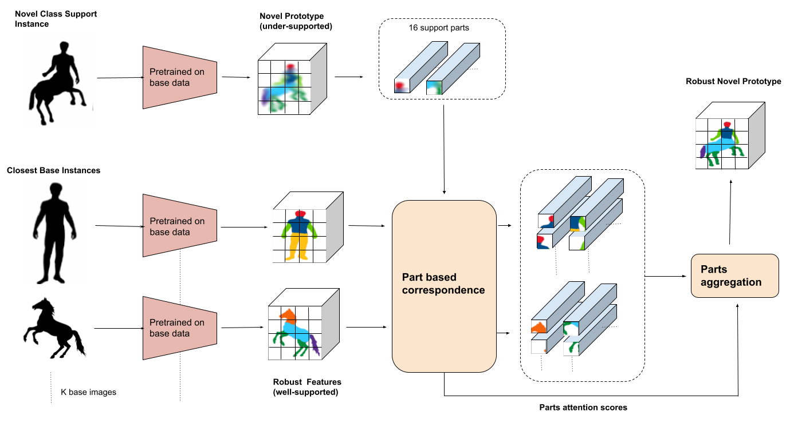
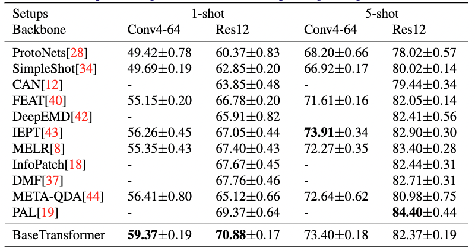
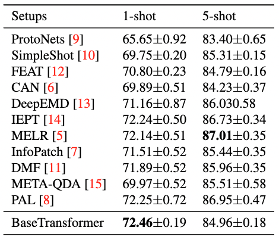
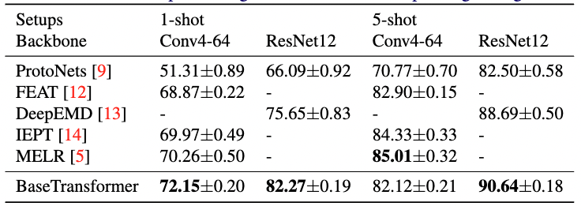

# BaseTransformers: Attention over base data-points for One Shot Learning
The code repository for "BaseTransformers: Attention over base data-points for One Shot Learning" [[paper]]() [[ArXiv]]() [[slides]]() (Accepted British Machine Vision Conference 2022) in PyTorch. If you use any content of this repo for your work, please cite the following bib entry:

    @article{maniparambil2022basetransformers,
    title={BaseTransformers: Attention over base data-points for One Shot Learning},
    author={Maniparambil, Mayug and McGuinness, Kevin and O'Connor, Noel},
    journal={arXiv preprint arXiv:2210.02476},
    year={2022}
    }

This repository has been adapted from the code repository of "Few-Shot Learning via Embedding Adaptation with Set-to-Set Functions" [[https://github.com/Sha-Lab/FEAT]](https://github.com/Sha-Lab/FEAT)

## BaseTransformers
We propose to make use of the well-trained feature representations of the base dataset that
are closest to each support instance to improve its representation during meta-test time. 
To this end, we propose BaseTransformers, that attends to the most relevant regions of the base dataset feature space and improves support instance representations.

## Standard Few-shot Learning Results

Experimental results on few-shot learning datasets with ResNet-12 backbone (ResNet12 same as [this repo](https://github.com/kjunelee/MetaOptNet)). We report average results with 10,000 randomly sampled few-shot learning episodes for stablized evaluation.

**MiniImageNet Dataset**

**TieredImageNet Dataset**

**CUB Dataset**

## Prerequisites

The following packages are required to run the scripts:

- [PyTorch-1.4 and torchvision](https://pytorch.org)

- Package [tensorboardX](https://github.com/lanpa/tensorboardX)

- wandb, tensorboardX, scipy, pandas, json2html, cockpit-for-pytorch

- Dataset: please download the dataset and put images into the folder data/[name of the dataset, miniimagenet or cub]/images

- Pre-trained weights: please download the [pre-trained weights](https://drive.google.com/drive/folders/1DhhJgW2YePwqcznghROWYszI-7gxcz7s?usp=sharing) of the encoder if needed and place them in saves/.

- Base 2d Cache and Query Cache: please download the base 2d cache and query cache as mentioned in the Cache section below and place them in embeds_cache/

## Docker
Alternatively, use docker to re-create the training environment we used. Requires docker, docker compose and nvidia-docker

    $ cd docker_nvidia/
      sudo docker compose build
      sudo docker compose up -d
      sudo docker exec -it BaseTransformers_n bash

Run the training commands once inside the docker-bash

## Dataset

### MiniImageNet Dataset

The MiniImageNet dataset is a subset of the ImageNet that includes a total number of 100 classes and 600 examples per class. We follow the [previous setup](https://github.com/twitter/meta-learning-lstm), and use 64 classes as SEEN categories, 16 and 20 as two sets of UNSEEN categories for model validation and evaluation, respectively. We download mini-imagenet from repo for paper [Optimization as a model for few-shot learning](https://drive.google.com/file/d/1BCxmqLANXHbBaWs8A7_jqfVUv8mydp5R/view)

### CUB Dataset
[Caltech-UCSD Birds (CUB) 200-2011 dataset](http://www.vision.caltech.edu/visipedia/CUB-200-2011.html) is initially designed for fine-grained classification. It contains in total 11,788 images of birds over 200 species. On CUB, we randomly sampled 100 species as SEEN classes, and another two 50 species are used as two UNSEEN sets. We crop all images with given bounding boxes before training. We test CUB with the ConvNet  and Res12 backbone in BaseTransformers.

### TieredImageNet Dataset
[TieredImageNet](https://github.com/renmengye/few-shot-ssl-public) is a large-scale dataset  with more categories, which contains 351, 97, and 160 categoriesfor model training, validation, and evaluation, respectively. The dataset can also be download from [here](https://github.com/kjunelee/MetaOptNet).
We only test TieredImageNet with ResNet backbone in our work.

Check [this](https://github.com/Sha-Lab/FEAT/blob/master/data/README.md) for details of data downloading and preprocessing.

## Caches

Base 2d features cache: Base features are pre-calculated. 

ConvNet
 - [mini-ImageNet](https://drive.google.com/file/d/1oBhGmOsA7V0xs01o7fh2jUcKR2zzisks/view?usp=sharing)
 - [CUB]()

  
Resnet-12
 - [mini-ImageNet](https://drive.google.com/file/d/1f6wNjwA5KNuo2S41nQEpDdt1Ud8ktvze/view?usp=sharing)  
 - [tiered-ImageNet](https://drive.google.com/file/d/1cGk1Owv6x9mDYtXPin6KctwGWRXDTo04/view?usp=sharing)
 - [CUB]()

Semantic querying cache: Closest base-instances are precalculated for faster training.
 - [mini-ImageNet](https://drive.google.com/file/d/1wy3f-nXbHQEZK4OsYCfQX5GxxZsUcQX-/view?usp=sharing)
 - [tiered-ImageNet](https://drive.google.com/file/d/1DSFcyu6Md6-u8Vsnun1mfCjGUWqV9pEe/view?usp=sharing)
 - [CUB]()

Download both base 2d features cache and querying cache and place them in embeds_cache/

## Code Structures
To reproduce our experiments with BaseTransformers, please use **train_fsl.py**. There are four parts in the code.
 - `model`: It contains the main files of the code, including the few-shot learning trainer, the dataloader, the network architectures, and baseline and comparison models.
 - `data`: Images and splits for the data sets.
 - `saves`: The pre-trained weights of different networks.
 - `checkpoints`: To save the trained models.

## Model Training and Evaluation
Please use **train_fsl.py** and follow the instructions below. The file will automatically evaluate the model on the meta-test set with 10,000 tasks after given epochs.

## Arguments
The train_fsl.py takes the following command line options (details are in the `model/utils.py`):

**Task Related Arguments**
- `dataset`: Option for the dataset (`MiniImageNet`, `TieredImageNet`, or `CUB`), default to `MiniImageNet`

- `way`: The number of classes in a few-shot task during meta-training, default to `5`

- `eval_way`: The number of classes in a few-shot task during meta-test, default to `5`

- `shot`: Number of instances in each class in a few-shot task during meta-training, default to `1`

- `eval_shot`: Number of instances in each class in a few-shot task during meta-test, default to `1`

- `query`: Number of instances in each class to evaluate the performance during meta-training, default to `15`

- `eval_query`: Number of instances in each class to evaluate the performance during meta-test, default to `15`

**Optimization Related Arguments**
- `max_epoch`: The maximum number of training epochs, default to `200`

- `episodes_per_epoch`: The number of tasks sampled in each epoch, default to `100`

- `num_eval_episodes`: The number of tasks sampled from the meta-val set to evaluate the performance of the model (note that we fix sampling 10,000 tasks from the meta-test set during final evaluation), default to `200`

- `lr`: Learning rate for the model, default to `0.0001` with pre-trained weights

- `lr_mul`: Training lr multiplier for BaseTransformers. The learning rate for the top layer will be multiplied by this value (usually with faster learning rate). Default to `10`

- `lr_scheduler`: The scheduler to set the learning rate (`step`, `multistep`, or `cosine`), default to `step`

- `step_size`: The step scheduler to decrease the learning rate. Set it to a single value if choose the `step` scheduler and provide multiple values when choosing the `multistep` scheduler. Default to `20`

- `gamma`: Learning rate ratio for `step` or `multistep` scheduler, default to `0.2`

- `fix_BN`: Set the encoder to the evaluation mode during the meta-training. This parameter is useful when meta-learning with the WRN. Default to `False`

- `augment`: Whether to do data augmentation or not during meta-training, default to `False`

- `mom`: The momentum value for the SGD optimizer, default to `0.9`

- `weight_decay`: The weight_decay value for SGD optimizer, default to `0.0005`

**Model Related Arguments**
- `model_class`: The model to use during meta-learning. We provide implementations for baselines (`MatchNet` and `ProtoNet`, 'FEAT'), and BaseTransformers. Default to `BaseTransformers`

- `use_euclidean`: Use the euclidean distance or the cosine similarity to compute pairwise distances. We use the euclidean distance in the paper. Default to `False`

- `backbone_class`: Types of the encoder, i.e., the convolution network (`ConvNet`) or ResNet-12 (`Res12`), default to `ConvNet`

- `balance`: This is the balance weight for the metasimclr loss. Default to `0`

- `temperature`: Temperature over the logits, we #divide# logits with this value. It is useful when meta-learning with pre-trained weights. Default to `1`

- `temperature2`: Temperature over the logits in the regularizer, we divide logits with this value. This is specially designed for the contrastive regularizer. Default to `1`

- 'embed_pool': Pooling operation for euclidian. Default 'post_loss_avg' works best
- 'feat_attn': Self attention over support instances similar to FEAT. Default 0.
- 'dim_model': Channel dimensions of encoder. Default 64.
- 'fast_query': Path to querying_cache
- 'embeds_cache_2d': Path to 2d base embeddings cache
- 'baseinstance_2d_norm': 2d normalization of base embeddings

**Other Arguments** 
- `orig_imsize`: Whether to resize the images before loading the data into the memory. `-1` means we do not resize the images and do not read all images into the memory. Default to `-1`

- `multi_gpu`: Whether to use multiple gpus during meta-training, default to `False`

- `gpu`: The index of GPU to use. Please provide multiple indexes if choose `multi_gpu`. Default to `0`

- `log_interval`: How often to log the meta-training information, default to every `50` tasks

- `eval_interval`: How often to validate the model over the meta-val set, default to every `1` epoch

- `save_dir`: The path to save the learned models, default to `./checkpoints`

Running the command without arguments will train the models with the default hyper-parameter values. Loss changes will be recorded as a tensorboard file.

## Training scripts for BaseTransformers

For example, to train the 1-shot/5-shot 5-way BaseTransformers model with ConvNet backbone on MiniImageNet

    $ python train_fsl.py  --max_epoch 200 --model_class FEATBaseTransformer3_2d --use_euclidean --backbone_class ConvNet --dataset MiniImageNet --way 5 --eval_way 5 --shot 1 --eval_shot 1 --query 15 --eval_query 15 --balance 0.0 --temperature 0.1 --temperature2 0.1 --lr 0.0001 --lr_mul 10 --lr_scheduler step --step_size 20 --gamma 0.5 --gpu 0 --init_weights ./saves/mini_conv4_ver11_113120.pth --eval_interval 1 --k 30 --base_protos 0 --feat_attn 0 --pass_ids 1 --base_wt 0.1 --remove_instances 1 --embed_pool post_loss_avg --orig_imsize 128 --fast_query ./embeds_cache/fastq_imgnet_wordnet_pathsim_random-preset-wts.pt --embeds_cache_2d ./embeds_cache/embeds_cache_cnn4_contrastive-init-ver1-1-corrected_2d.pt --wandb_mode disabled --mixed_precision O2 --z_norm before_tx
    
    $ python train_fsl.py  --max_epoch 200 --model_class FEATBaseTransformer3_2d --use_euclidean --backbone_class ConvNet --dataset MiniImageNet --way 5 --eval_way 5 --shot 5 --eval_shot 5 --query 15 --eval_query 15 --balance 0 --temperature 0.1 --temperature2 0.1 --lr 0.0001 --lr_mul 10 --lr_scheduler step --step_size 20 --gamma 0.5 --gpu 0 --init_weights ./saves/mini_conv4_ver11_113120.pth --eval_interval 1 --k 30 --base_protos 0 --feat_attn 0 --pass_ids 1 --base_wt 0.1 --remove_instances 1 --embed_pool post_loss_avg --orig_imsize 128 --fast_query ./embeds_cache/fastq_imgnet_wordnet_pathsim_random-preset-wts.pt --embeds_cache_2d ./embeds_cache/embeds_cache_cnn4_contrastive-init-ver1-1-corrected_2d.pt --wandb_mode disabled --mixed_precision O2 --z_norm before_tx

to train the 1-shot/5-shot 5-way BaseTransformer model with ResNet-12 backbone on MiniImageNet:

    $ python train_fsl.py  --max_epoch 200 --model_class FEATBaseTransformer3_2d --use_euclidean --backbone_class Res12 --dataset MiniImageNet --way 5 --eval_way 5 --shot 1 --eval_shot 1 --query 15 --eval_query 15 --balance 0.1 --temperature 0.1 --temperature2 0.1 --lr 0.0002 --lr_mul 10 --lr_scheduler step --step_size 40 --gamma 0.5 --gpu 0 --init_weights ./saves/mini_r12_ver2_corrected_140403.pth --eval_interval 1 --k 30 --base_protos 0 --feat_attn 0 --pass_ids 1 --base_wt 0.1 --orig_imsize 128 --embed_pool post_loss_avg --dim_model 640 --remove_instances 1 --fast_query ./embeds_cache/fastq_imgnet_wordnet_pathsim_random-preset-wts.pt --embeds_cache_2d ./embeds_cache/embeds_cache_res12_ver2-640-140403_evalon_2d.pt --baseinstance_2d_norm True --return_simclr 2 --simclr_loss_type ver2.2 --wandb_mode disabled --exp_name mini_1shot --mixed_precision O2 --z_norm before_tx

    $ python train_fsl.py  --max_epoch 200 --model_class FEATBaseTransformer3_2d --use_euclidean --backbone_class Res12 --dataset MiniImageNet --way 5 --eval_way 5 --shot 5 --eval_shot 5 --query 15 --eval_query 15 --balance 0 --temperature 0.1 --temperature2 0.1 --lr 0.0005 --lr_mul 10 --lr_scheduler step --step_size 40 --gamma 0.5 --gpu 0 --init_weights ./saves/mini_r12_ver2_corrected_140403.pth --eval_interval 1 --k 10 --base_protos 0 --feat_attn 0 --pass_ids 1 --base_wt 0.1 --orig_imsize 128 --embed_pool post_loss_avg --dim_model 640 --remove_instances 1 --fast_query ./embeds_cache/fastq_imgnet_wordnet_pathsim_random-preset-wts.pt --embeds_cache_2d ./embeds_cache/embeds_cache_res12_ver2-640-140403_evalon_2d.pt --baseinstance_2d_norm True --wandb_mode disabled --exp_name mini_5shot --mixed_precision O2 --z_norm before_tx

to train the 1-shot/5-shot 5-way BaseTransformer model with ResNet-12 backbone on TieredImageNet:

    $ python train_fsl.py  --max_epoch 100 --model_class FEATBaseTransformer3_2d --use_euclidean --backbone_class Res12 --dataset TieredImageNet_og --way 5 --eval_way 5 --shot 1 --eval_shot 1 --query 15 --eval_query 15 --balance 0 --temperature 0.1 --temperature2 0.1 --lr 0.0002 --lr_mul 10 --lr_scheduler step --step_size 40 --gamma 0.5 --gpu 0 --init_weights ./saves/tiered_r12_og_nosimclr_180842.pth --eval_interval 1 --base_protos 0 --feat_attn 0 --pass_ids 1 --base_wt 0.1 --remove_instances 1 --embed_pool post_loss_avg --orig_imsize -1 --dim_model 640 --fast_query ./embeds_cache/fastq_tiered_wordnetdef-hypernyms-bert-closest_classes_randomsample_eqlwts_classes-sampling.pt --embeds_cache_2d ./embeds_cache/ti_og_r12-default-180842_classwise_2d_new.pt --k 30 --mixed_precision O2 --wandb_mode disabled --exp_name tiered_1shot --z_norm before_tx

    $ python train_fsl.py  --max_epoch 100 --model_class FEATBaseTransformer3_2d --use_euclidean --backbone_class Res12 --dataset TieredImageNet_og --way 5 --eval_way 5 --shot 5 --eval_shot 5 --query 15 --eval_query 15 --balance 0 --temperature 0.1 --temperature2 0.1 --lr 0.0002 --lr_mul 10 --lr_scheduler step --step_size 40 --gamma 0.5 --gpu 0 --init_weights ./saves/tiered_r12_og_nosimclr_180842.pth --eval_interval 1 --base_protos 0 --feat_attn 0 --pass_ids 1 --base_wt 0.1 --remove_instances 1 --embed_pool post_loss_avg --orig_imsize -1 --dim_model 640 --fast_query ./embeds_cache/fastq_tiered_wordnetdef-hypernyms-bert-closest_classes_randomsample_eqlwts_classes-sampling.pt --embeds_cache_2d ./embeds_cache/ti_og_r12-default-180842_classwise_2d_new.pt --k 30 --mixed_precision O2 --wandb_mode disabled --exp_name tiered_5shot --z_norm before_tx

## Trained weights for BaseTransformers
Trained weights are available at [gdrive_link](https://drive.google.com/drive/folders/1Zh8NPYP7FUD24HiNY_WoHKxBvZ-t4Mhu?usp=sharing). The names of the files are [dataset]_[encoder]_[numberofshots]shot.pth. 

To check test performance use the training scripts as mentioned in 'Training scripts for BaseTransformers' section above with the test argument followed by path to the testing checkpoint.

For example to test the performance of Conv4 1 shot on mini-Imagenet one would use the following command. 

    $ python train_fsl.py  --max_epoch 200 --model_class FEATBaseTransformer3_2d --use_euclidean --backbone_class ConvNet --dataset MiniImageNet --way 5 --eval_way 5 --shot 1 --eval_shot 1 --query 15 --eval_query 15 --balance 0.0 --temperature 0.1 --temperature2 0.1 --lr 0.0001 --lr_mul 10 --lr_scheduler step --step_size 20 --gamma 0.5 --gpu 0 --init_weights ./saves/mini_conv4_ver11_113120.pth --eval_interval 1 --k 40 --base_protos 0 --feat_attn 0 --pass_ids 1 --base_wt 0.1 --remove_instances 1 --embed_pool post_loss_avg --orig_imsize 128 --fast_query ./embeds_cache/fastq_imgnet_wordnet_pathsim_random-preset-wts.pt --embeds_cache_2d ./embeds_cache/embeds_cache_cnn4_contrastive-init-ver1-1-corrected_2d.pt --wandb_mode disabled --mixed_precision O2 --z_norm before_tx --test ./test_weights/mini_conv4_1shot.pth

Note: It has been observed that using a higher k than that of the training results in higher performance for 1 shot.

## Acknowledgment
We thank the following repos providing helpful components/functions in our work.
- [FEAT](https://github.com/Sha-Lab/FEAT)
- [ProtoNet](https://github.com/cyvius96/prototypical-network-pytorch)

- [MatchingNet](https://github.com/gitabcworld/MatchingNetworks)

- [PFA](https://github.com/joe-siyuan-qiao/FewShot-CVPR/)

- [Transformer](https://github.com/jadore801120/attention-is-all-you-need-pytorch)

- [MetaOptNet](https://github.com/kjunelee/MetaOptNet/)

## Contact
Feel free to raise and issue or contact me at mayugmaniparambil@gmail.com for queries and discussions.

